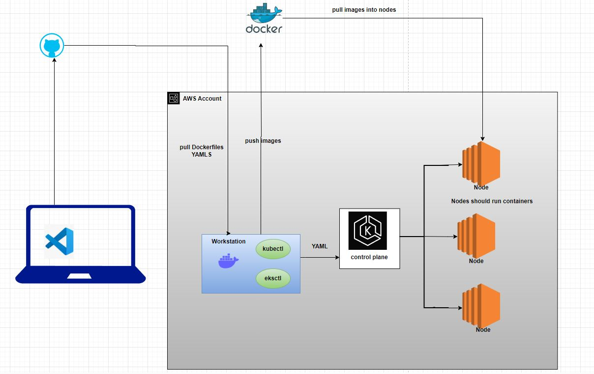

installing eksctl
------------------
curl --silent --location "https://github.com/weaveworks/eksctl/releases/latest/download/eksctl_Linux_amd64.tar.gz" | tar xz -C /tmp  
sudo mv /tmp/eksctl /usr/local/bin
eksctl version

installing kubectl
-----------------------
curl -O https://s3.us-west-2.amazonaws.com/amazon-eks/1.30.2/2024-07-12/bin/linux/amd64/kubectl
chmod +x ./kubectl
sudo mv kubectl /usr/local/bin (if this is done, any user logged in can use)
kubectl version --(we get client version and server version)

aws configure/ adding role.

